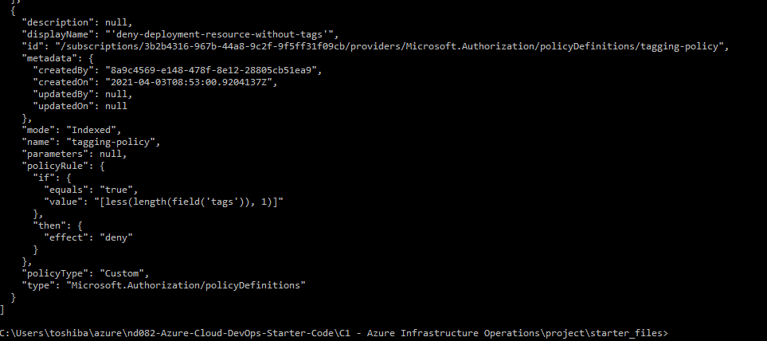
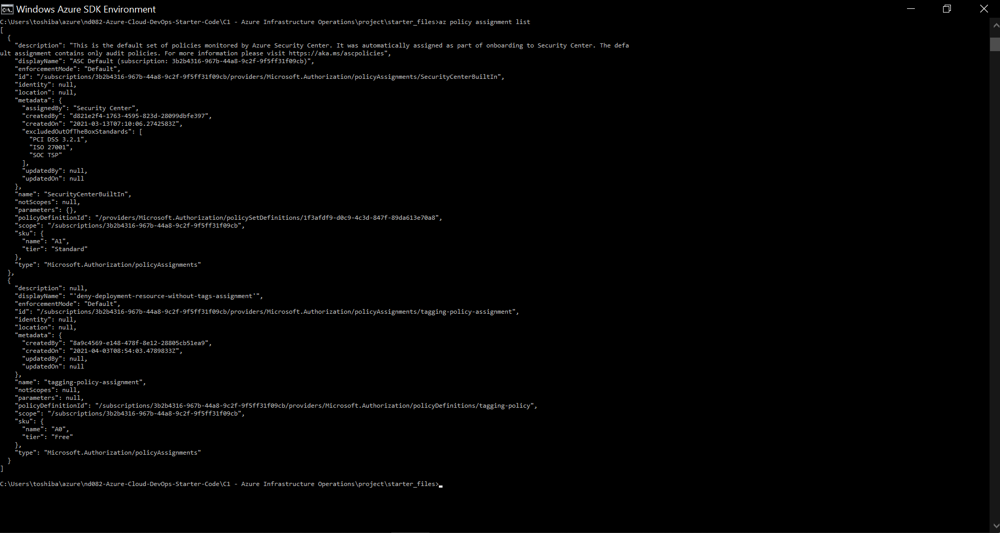
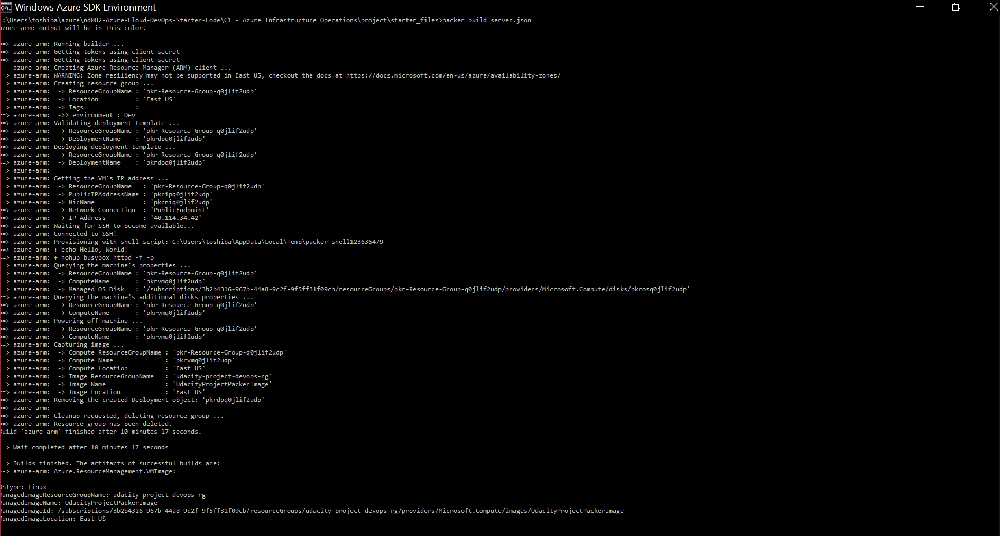
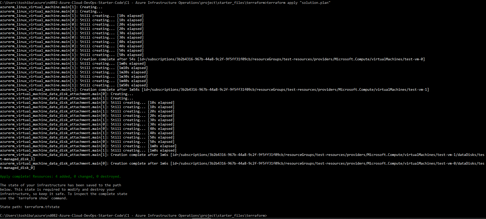
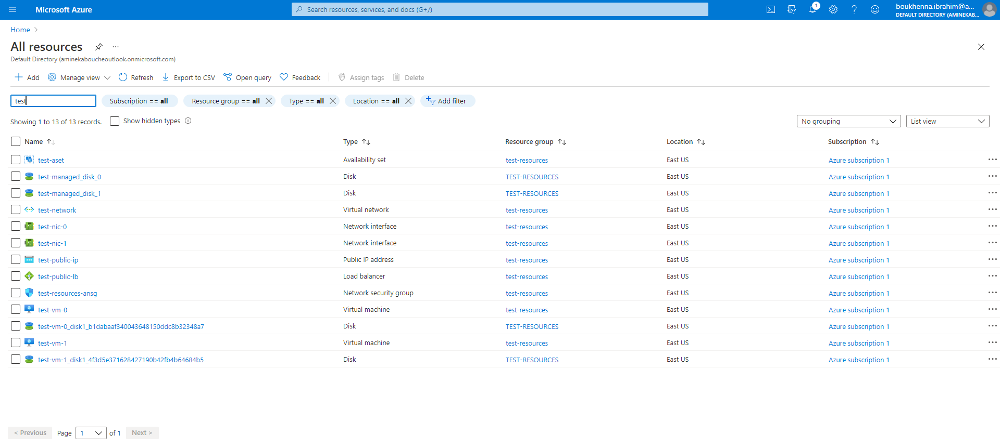
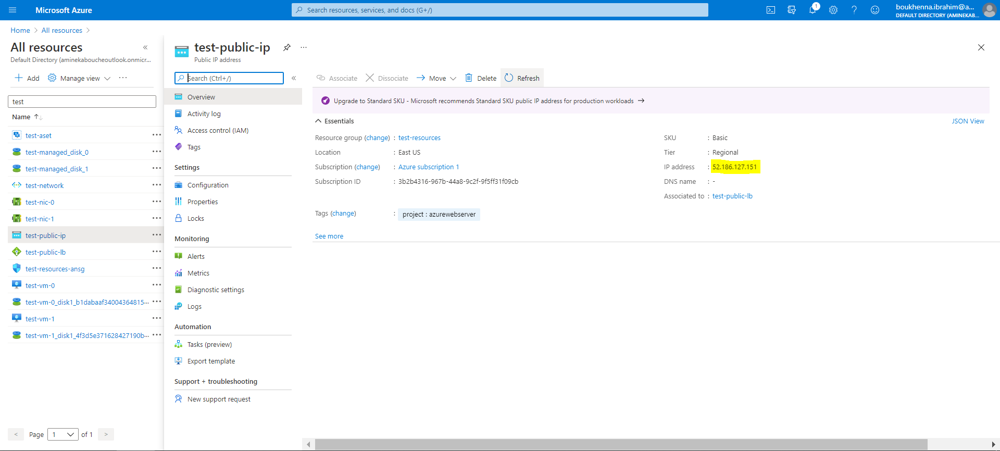
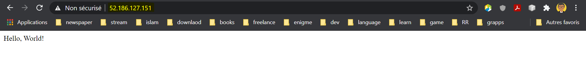

# Azure Infrastructure Operations Project: Deploying a scalable IaaS web server in Azure

### Introduction
For this project, you will write a Packer template and a Terraform template to deploy a customizable, scalable web server in Azure.

### Getting Started
1. Clone this repository

2. Create your infrastructure as code

3. Update this README to reflect how someone would use your code.

### Dependencies
1. Create an [Azure Account](https://portal.azure.com) 
2. Install the [Azure command line interface](https://docs.microsoft.com/en-us/cli/azure/install-azure-cli?view=azure-cli-latest)
3. Install [Packer](https://www.packer.io/downloads)
4. Install [Terraform](https://www.terraform.io/downloads.html)

### Instructions
1. Login to azure account using the azure CLI:
    ``` bash
    az login 
    ```
2. Create a policy and an assignment: 
    ``` bash
    az policy definition create --name tagging-policy --display-name 'deny-deployment-resource-without-tags' --rules tagging-policy.json --mode Indexed

    az policy assignment create --name tagging-policy-assignment --display-name 'deny-deployment-resource-without-tags-assignment' --policy tagging-policy
    ```
3. Check a policy and an assignment: 
    ``` bash
    az policy definition list

    az policy assignment list
    ```
4. Create a resource group for packer image:
    ``` bash
    az group create -n udacity-project-devops-rg -l eastus
    ```
5. Create a service principle:
    ``` bash
    ​az ad sp create-for-rbac --query "{​​​​​ client_id: appId, client_secret: password, tenant_id: tenant }​​​​​"
    ```
6. Create a Packer image:
    ``` bash
    packer validate server.json
    packer build server.json
    ```
7. Edit files of Terraform template:
   - [variables.tf](variables.tf) file: contains variables to customize the template, edit the default parameter for each variables.
       - tenant_id: the tenant_id of your azure session
       - subscription_id: the subscription_id of your azure session
       - prefix: the prefix for all the resoures
       - vmcount: the number of VMs to be created
       - ...
   - [main.tf](main.tf) file: contains the infrastructure to be created in azure.
8. Create the infrastructure with Terraform:
   - Initialize Terraform
        ``` bash
        terraform init 
        ```
   - Create Terraform plan
        ``` bash
        terraform plan -out solution.plan 
        ```
   - Deploy the infrastruture
        ``` bash
        terraform apply solution.plan
        ```
9. Check the infrastructure
   - Open azure portal
   - Get the IP address from ip address resource
   - Open a browser on the public IP address
10. Destroy all the resoures created by terraform
   ``` bash
   terraform destroy 
   ```

### Output
1. Output of policy definition list


2. Output of policy assignment list


3. Output of Create a Packer image


4. Output of Create Terraform plan
[solution.plan](solution.plan)

5. Output of Deploy the infrastruture


6. Output of Deploy the infrastruture in azure


7. Output of IP address in azure


8. Output of browser

